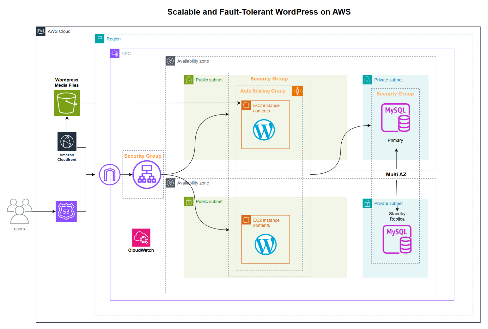

# **Scalable and Fault-Tolerant WordPress Web Site on AWS**

- **Project created by** <span style="color: #3598db;">**Barbara Papa**</span>
- **Course:** <span style="color: #3598db;">**AWS Cloud Computing**</span>
- **Teachers:** <span style="color: #3598db;">**Vijay Anandh, Michael Wagener**</span>

* * *

## **Summary**

This project implements a **scalable and fault-tolerant WordPress** deployment on **AWS**, leveraging services within the **AWS Free Tier**.  
The goal is to build a highly available and cost-effective infrastructure for hosting a WordPress site with minimal expenses.

The architecture consists of an **Application Load Balancer (ALB)** distributing traffic across an **Auto Scaling Group** of EC2 instances deployed across multiple **Availability Zones**, ensuring reliability and high availability.

A **Multi-AZ RDS MySQL database** is used for data persistence, with a standby replica to enhance fault tolerance.  
**Amazon S3** stores media files, reducing storage costs and improving scalability.

The system is secured using **Security Groups**, and **AWS CloudFront** is integrated to optimize content delivery.  
Additionally, **Amazon Route 53** provides domain name resolution, while **CloudWatch** is used for monitoring and logging.

This setup enables a **resilient WordPress environment** that can handle traffic spikes, maintain performance, and remain within the **AWS Free Tier**, making it ideal for small businesses, blogs, or personal projects.

* * *

## **Contents**

1.  **Introduction**
    - Background
    - Problem statement
    - Objectives
2.  **Methodology & Techniques**
3.  **Architecture**
4.  **Development process**
    - Infrastructure Provisioning with Terraform
    - Manual Configuration
    - Migrate WordPress Website
    - Connecting WordPress to S3
    - Testing and Optimization
    - Security Considerations
5.  **Challenges faced**
6.  **Key Takeaways**
7.  **Future Enhancements**
8.  **References**

* * *

## **1\. Introduction**

### Background

WordPress is one of the most popular content management systems (CMS) used worldwide. Traditional hosting solutions often struggle with scalability, performance, and cost efficiency. This project aims to demonstrate how AWS services can be leveraged to build a **scalable, cost-effective, and fault-tolerant** WordPress deployment.

### Problem Statement

Hosting WordPress on a single EC2 instance can lead to **downtime, performance bottlenecks, and security risks**. A scalable and redundant architecture is needed to ensure high availability, resilience, and cost-effectiveness while staying within AWS Free Tier limits.

### Objectives

- Deploy a **scalable and fault-tolerant WordPress** environment on AWS.
    
- Use an **Application Load Balancer (ALB)** to distribute traffic across instances and improve availability.
    
- Implement **Auto Scaling** to ensure elasticity and handle traffic spikes.
    
- Use a **highly available MySQL database** with Amazon RDS Multi-AZ deployment.
    
- Optimize cost efficiency by utilizing **S3 for media storage** and **CloudFront for content caching**.
    
- Secure the deployment using **Security Groups** and **AWS best practices**.
    
- Stay **within AWS Free Tier limits** to minimize costs.
    

* * *

## **2\. Methodology & Techniques**

- **Infrastructure as Code (IaC):** Most of the infrastructure was provisioned using <span style="color: #3598db;">**Terraform**</span>, ensuring consistency, automation, and easy replication.
- **Manual Configuration:** Some AWS services, including **CloudWatch, Route 53, CloudFront, and Multi-AZ RDS**, were configured manually via the <span style="color: #3598db;">**AWS Management Console**</span> to fine-tune settings and ensure proper integration.
- **Version Control:** <span style="color: #3598db;">**GitHub**</span> was used to store and track Terraform configurations and infrastructure changes.
- **Automation & CLI:** <span style="color: #3598db;">**AWS CLI**</span> was used alongside Terraform for managing AWS resources and quick configuration tasks.
- **Diagramming & Planning:** <span style="color: #3598db;">**draw.io**</span> was used to design the architecture diagram, while <span style="color: #3598db;">**Trello**</span> helped track tasks and project progress.
- **Development & Deployment:**
    - <span style="color: #3598db;">**Visual Studio Code**</span> was the primary development environment for writing Terraform scripts and managing configurations.
    - <span style="color: #3598db;">**XAMPP**</span> was used to create the website which was then migrated to the EC2 instance
    - <span style="color: #3598db;">**WordPress**</span> was configured on AWS EC2 instances and used to build the website

By combining **Terraform for automation** with **manual fine-tuning of key AWS services**, the project achieved a **balance between flexibility, control, and cost efficiency**, ensuring a **resilient WordPress deployment** on AWS.

* * *

## **3\. Architecture**



**Interaction Between Components**

1.  **User Requests & Traffic Distribution**
    
    - Users access the WordPress website via a **domain name managed by Amazon Route 53**.
    - Route 53 directs traffic to the **Application Load Balancer (ALB)**, which distributes incoming requests across multiple EC2 instances in an **Auto Scaling Group**.
2.  **EC2 Instances & WordPress Application**
    
    - The ALB forwards requests to the **EC2 instances** running WordPress, deployed across multiple **Availability Zones (AZs)** for high availability.
    - Each EC2 instance retrieves media files from an **Amazon S3 bucket**, reducing local storage needs and improving scalability.
3.  **Database Layer & High Availability**
    
    - WordPress stores and retrieves content from an **Amazon RDS Multi-AZ MySQL database**, ensuring redundancy.
    - The **primary database instance** processes requests, while a **standby replica** in a different AZ ensures failover support.
4.  **Content Delivery & Performance Optimization**
    
    - **Amazon CloudFront**, acting as a Content Delivery Network (CDN), caches static assets (like images, CSS, and JavaScript) from S3 and EC2 instances to speed up content delivery to users worldwide.
5.  **Security & Access Control**
    
    - **Security Groups** protect EC2 instances, the ALB, and RDS by restricting access to specific IP ranges and ports.
    - The **database is only accessible from EC2 instances**, preventing external exposure.
6.  **Monitoring & Logging**
    
    - **Amazon CloudWatch** collects performance metrics and logs from EC2 instances, ALB, and RDS, enabling monitoring and troubleshooting.

* * *

## 4\. Development Process:

## **Step 1**: Infrastructure Provisioning with Terraform

The majority of the infrastructure was provisioned using Terraform, following Infrastructure as Code (IaC) principles.  
The key resources created include:

- **VPC** with public and private subnets.
- **Security Groups** for EC2, ALB, and RDS.
- **Internet Gateway and Routing Tables** to enable external connectivity.
- **Auto Scaling Group and Launch Template** for EC2 instances.
- **RDS MySQL Database** hosted in private subnets.
- **Application Load Balancer (ALB)** for distributing traffic.
- **S3 Bucket** for storing media files.

&nbsp;  
**Before starting deployment, It is necessary to have:**

- An active AWS account
- AWS CLI installed and configured with valid credentials
- Terraform installed ([Official Guide](https://developer.hashicorp.com/terraform/downloads))
- An SSH key to access EC2 instances

&nbsp;

### Deployment Commands

1.  **Initialize Terraform**

```
terraform init
```

2.  **Plan Deployment**

```
terraform plan
```

3.  **Apply Changes**

```
terraform apply
```

4.  **View Outputs**

```
terraform output
```

### Removing Infrastructure

To destroy the entire infrastructure:

```
terraform destroy
```

&nbsp;

## Infrastructure Details

### VPC and Subnets

```
resource "aws_vpc" "my_vpc" {
cidr_block = "10.0.0.0/16"
}
```

### Security Groups

Security rules allow HTTP access on port 80 and SSH on 22 (NOTE: <span style="color: #3598db;">SSH on 22 "0.0.0.0/0" is <span>for testing only</span></span>):

```
resource "aws_security_group" "ec2_security_group" {
ingress { from_port = 80, to_port = 80, protocol = "tcp",
security_groups = [aws_security_group.alb_security_group.id] }
ingress { from_port = 22, to_port = 22, protocol = "tcp", cidr_blocks = ["0.0.0.0/0"] }
}
```

### EC2 and Auto Scaling

```
resource "aws_launch_template" "my_launch_template" {
 name = "MyLaunchTemplate"
 instance_type = var.instance_type
 key_name = var.key_name
 image_id = "ami-0a897ba00eaed7398" #Amazon linux us-west-2
 user_data = filebase64("${path.module}/user-data.sh")
}
```

### RDS Database

```
resource "aws_db_instance" "my_rds_instance" {
 engine = "mysql"
 db_name = var.db_name
 username = var.db_user
 password = var.db_password
}
```

### S3 Buckets

```
resource "aws_s3_bucket" "wordpress_media" {
 bucket = var.s3_bucket_name
}
```

## Installation Script (`user-data.sh`)

The script automatically configures Apache, MySQL Client, PHP and WordPress:

```
#!/bin/bash
sudo yum install -y httpd php php-mysqlnd
sudo systemctl start httpd
sudo cp -r wordpress/* /var/www/html/
sudo chown -R apache:apache /var/www/html/
```

* * *

## **Step 2**: Manual Configuration

After Terraform provisioning, certain AWS services required manual configuration via the AWS Management Console:

#### **1\. Configure CloudWatch for Monitoring and Alarms**

- Go to **CloudWatch** in the AWS Console.
- Navigate to **Alarms** → Click **Create Alarm**.
- Select **EC2 Instance Metrics** (e.g., CPU Utilization, Disk Space, Network Traffic).
- Set a **threshold** (e.g., if CPU utilization exceeds 70% for 5 minutes).
- Choose **SNS Notification** to send alerts.
- Repeat for **RDS Metrics** (e.g., free storage space, CPU utilization).
- Save and **activate alarms**.

#### **2\. Configure Route 53 for Custom Domain and DNS Records**

- Go to **Route 53** and create a **Hosted Zone** for your domain (e.g., `mywebsite.com`).
    
- Add an **A Record**:
    
    - Select **Alias** and point it to the **Application Load Balancer (ALB)**.
- Add a **CNAME Record** (for `www.mywebsite.com` → `mywebsite.com`).
    
- Configure **TTL (Time to Live)** for caching.
    
- Test DNS propagation using:
    
    `nslookup mywebsite.com`
    

#### **3\. Configure CloudFront for Content Delivery Acceleration**

- Go to **CloudFront** → Click **Create Distribution**.
    
- Set **Origin** as the ALB DNS or S3 Bucket (if serving static content).
    
- Enable **Caching** for static assets (CSS, JS, images).
    
- Configure **HTTPS** (Use AWS Certificate Manager to request a certificate).
    
- Restrict S3 Bucket access using an **Origin Access Identity (OAI)**.
    
- Deploy and test CloudFront using:
    
    `curl -I https://d123456789.cloudfront.net`
    

#### **4\. Verify Multi-AZ Deployment for RDS**

- Go to **RDS** in the AWS Console.
    
- Click on your database instance → Check **Multi-AZ Deployment** status.
    
- If not enabled, modify the instance to enable **Multi-AZ**.
    
- Verify automatic failover by forcing a failover test:
    
    `aws rds reboot-db-instance --db-instance-identifier mydb --force-failover`
    

* * *

## **Step 3**:  Migrate WordPress Website

The EC2 instances were configured using a **user-data** script during launch.

### **Migrate Website from XAMPP to EC2 Instance:**

### 1\. **Access the EC2 Instance**

Connect to the instance via SSH:

```
ssh -i <FILE.PEM> ec2-user@<PUBLIC-IP>
```

### 2\. **Transfer WordPress Site Files**

Use `scp` to copy files from your PC to the instance:

```
scp -i <FILE.PEM> -r /path/to/your/wordpress/ ec2-user@<PUBLIC-IP>:/var/www/html/
```

> Make sure `/var/www/html` contains the site and not a pre-installed version.

### 3\. **Set Correct Permissions**

After transferring the files, set the correct permissions:

```
sudo chown -R apache:apache /var/www/html/
sudo chmod -R 755 /var/www/html/
```

### 4\. **Import the Database**

- Export the database from XAMPP (usually via phpMyAdmin).
    
- Transfer the database to the instance:
    
    ```
    scp -i <FILE.PEM> backup.sql ec2-user@<PUBLIC-IP>:~
    ```
    
- Connect to the MySQL database on the instance and import the backup:
    
    ```
    mysql -u wordpressuser -p wordpressdb < backup.sql
    ```
    
    > Link the database in `wp-config.php`.
    

### 5\. **Update `wp-config.php`**

Edit `/var/www/html/wp-config.php` with the database credentials used on the instance.

### 6\. **Restart Apache**

```
sudo systemctl restart httpd
```

Now the migrated WordPress site is accessible at the instance's public IP.

* * *

## **Step 4**: Connecting WordPress to S3

To store media files in **S3**, the plugin **WP Offload Media Lite** was used.  
The configuration steps included:

1.  Installing and activating an WP Offload Media Lite.
2.  Providing the S3 bucket name.
3.  Setting up the correct IAM permissions to allow WordPress to upload files.
4.  Testing uploads to ensure media files were stored in S3.

* * *

## **Step 5**: Testing and Optimization

After setting up the environment, various tests were conducted:

#### **1\. Load Testing**

- Simulated **high traffic** to test **Auto Scaling Group** behavior.
- Verified that additional **EC2 instances** launched automatically under load.

#### **2\. Failover Testing**

- **Shut down** the primary RDS instance to trigger **Multi-AZ failover**.
- Ensured automatic failover to the standby instance without downtime.

#### **3\. Latency Tests**

- Measured **website response times** with and without **CloudFront caching**.
- Ensured CloudFront significantly improved content delivery speed.

#### **4\. Security Audits**

- Reviewed **security group** and **firewall** rules to ensure correct configurations.
- Verified **least privilege access** for IAM roles and policies.

#### **5\. Connectivity Testing**

- Verified that the website was **accessible** via the **Application Load Balancer (ALB)**.
- Ensured proper routing of requests to **EC2 instances**.

#### **6\. Database Connection**

- Confirmed that WordPress **successfully connected** to the **RDS database**.
- Checked database read/write operations.

#### **7\. S3 Integration**

- Uploaded test media files to WordPress and verified storage in **S3 Bucket**.
- Ensured **IAM permissions** allowed successful file uploads.

#### **8\. Load Balancer Functionality**

- Simulated traffic to ensure the **ALB** correctly distributed requests.
- Verified that **failed EC2 instances** were replaced automatically.

#### **9\. DNS Resolution**

- Checked that **Route 53** correctly resolved the **custom domain** to the ALB.
- Used `nslookup` and `dig` to validate DNS propagation.

* * *

## **Step 6**: Security Considerations

After testing, minor tweaks were made to **security groups**, **scaling policies**, and **performance settings.**

### Security Considerations:

- **Database credentials <span style="color: #3598db;">should not be hardcoded</span>**
- **SSH access to `0.0.0.0/0` <span style="color: #3598db;">should be restricted</span> for production environments**
- **Auto Scaling should be monitored to avoid excessive costs**

&nbsp;<span style="color: #2dc26b;"><span style="color: #000000;">Finally, all configurations were documented to ensure maintainability.</span></span>

* * *

## **5\. Challenges Faced:**

1.  **Staying within AWS Free Tier limits:**
    
    - Many AWS services have usage limits under the Free Tier, making it essential to choose cost-effective configurations.
2.  **Ensuring high availability:**
    
    - A single EC2 instance would be a single point of failure, so an **Auto Scaling Group with an Application Load Balancer (ALB)** was used to distribute traffic across instances in multiple availability zones.
3.  **Database reliability and performance:**
    
    - Using **Amazon RDS Multi-AZ** ensures database redundancy, reducing downtime risks.
4.  **Optimizing storage for WordPress media files:**
    
    - Instead of storing files directly on EC2, **Amazon S3** was integrated to offload storage, improve scalability, and reduce instance storage costs.
5.  **Security and access control:**
    
    - **Security Groups** were configured to restrict access to necessary ports and IPs.
        
    - Public access to the database was disabled, allowing only EC2 instances to connect.
        
6.  **Performance optimization for global users:**
    
    - **Amazon CloudFront** was implemented to cache static assets and deliver content faster to users worldwide.

&nbsp;

* * *

## **6\. Key Takeaways**

- A well-architected AWS solution can provide **scalability, fault tolerance, and cost-efficiency**.
- **CloudFront and S3 significantly reduce EC2 load** and improve response times.
- **RDS Multi-AZ improves availability** without manual intervention.
- **AWS Free Tier allows building a robust system with minimal cost**.

* * *

## **7\. Future Enhancements**

- Implement **Amazon Aurora** for better database performance.
- Use **AWS Lambda for automated backups** and serverless tasks.
- Enhance **Terraform modules** for reusable infrastructure components.
- Implement **WAF (Web Application Firewall)** for enhanced security.
- Explore **Amazon ECS or EKS** for containerized deployment of WordPress.

&nbsp;

**This project demonstrates how to build a scalable and fault-tolerant WordPress deployment on AWS while keeping costs minimal.**  
**Future expansions can further enhance the system’s performance, security, and automation.**

* * *

## <span style="color: #000000;">**<span>8\. References</span>**</span>

**AWS Documentation:**  https://docs.aws.amazon.com/

**Terraform Documentation:** https://registry.terraform.io/providers/hashicorp/aws/latest/docs

**To install Terraform:**  https://developer.hashicorp.com/terraform/install

**WordPress:** https://wordpress.org/

**XAMPP:** https://www.apachefriends.org/

**Draw.io:** https://app.diagrams.net/

**Visual Studio Code:** https://code.visualstudio.com/

**GitHub:** https://github.com/

* * *

&nbsp;

&nbsp;
